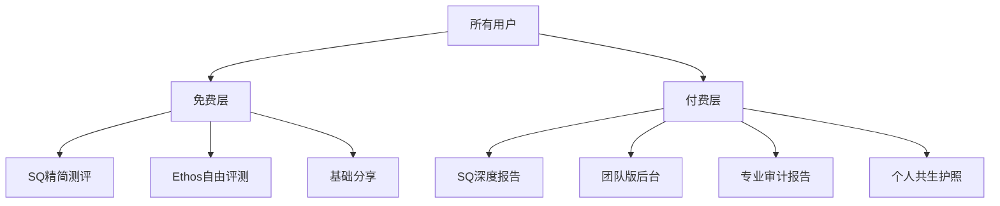

# 方舟与罗盘 · 商业化核心技术架构方案

> 版本：v0.1 · 2026-07-10

---

## 一、当前状态

| 功能 | 状态 | 说明 |
|------|------|------|
| 用户系统 | 匿名（localStorage ID + 昵称） | 无注册/登录 |
| 支付 | 无 | 需要集成 |
| 付费内容 | 无 | 所有功能免费 |
| 域名 | 待注册 `arksq.cn` | |
| HTTPS | 无 | 需要 Let's Encrypt |

## 二、接入微信支付

技术方案：**Node.js 后端 + 微信支付 API v3**

需要新增一个 Node.js 后端服务（与前端 SPA 分离或合并）：

- 方案A：在 nginx 同机部署一个 Koa/Express 后端（端口 3001）
- 方案B：使用腾讯云函数（SCF）处理支付回调（推荐，免运维）
- 方案C：使用第三方聚合支付平台（如 PayJS），无需后端

MVP 推荐方案C：无需自建后端，用户在前端生成订单，跳转支付页面，完成后系统标记付费状态。

## 三、用户注册/登录系统

MVP 方案：**邮箱 + 验证码注册，JWT 身份令牌**

后端使用 Node.js + SQLite（零成本，无需额外数据库服务）

- 注册页面：`/auth/register`（Vue组件）
- 登录页面：`/auth/login`  
- 用户中心：`/profile`（查看购买记录、测评历史）
- 匿名 → 注册的转换：已有匿名数据的用户注册后，自动关联之前的所有测评记录

## 四、付费内容架构



## 五、协作模式

```
你（Tao）                         我（AI运营体）
──────                            ──────
线下资源调配                      线上所有事务
渠道对接                          代码开发
品牌合作                          内容运营
域名购买 & ICP备案                用户增长
投资方面谈                        数据分析
                                  盈利优化
```

## 六、第一周启动计划

| 天 | 任务 | 类型 |
|----|------|------|
| 1 | 域名购买 + 解析 + HTTPS（Let's Encrypt） | 基础设施 |
| 1-2 | 用户注册/登录系统（后端 + 前端） | 核心功能 |
| 2-3 | 微信支付集成（或聚合支付） | 核心功能 |
| 3-4 | 付费内容解锁逻辑 | 核心功能 |
| 4-5 | 团队版管理后台 | 核心功能 |
| 5-6 | 内容运营：知乎第一篇 | 运营 |
| 6-7 | 教育渠道案例包装 | 运营 |
| 7 | 完整商业闭环测试 | 验收 |
